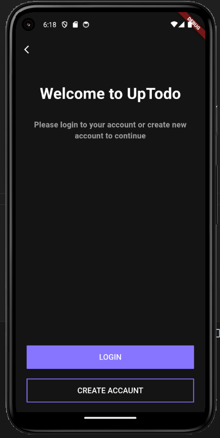
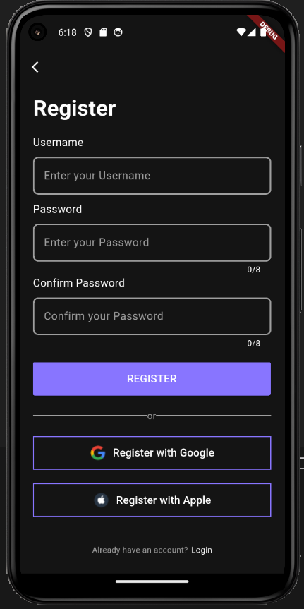
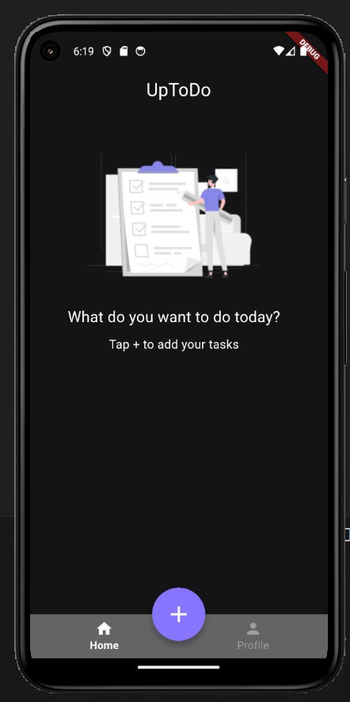

# 📝 UpToDo

A simple Flutter app built for learning purposes.  
The app demonstrates basic app structure, navigation, and UI patterns — including onboarding, authentication screens, and a functional task list with timestamps.

---

## 📸 Demo / Preview
Screenshots are stored in `image/screenshots/`

| Welcome | Register | Home |
|:--------:|:--------:|:----:|
|  |  |  |

---

##  What this app does
**UpToDo** is a small practice project built with Flutter.  
It includes both UI and functional features to simulate a real-world ToDo app:

- Multi-screen **Onboarding** flow with “Next” / “Skip” buttons  
- **Registration/Login** screens (UI only — local form validation)  
- **Main screen** with two tabs: **Home** (tasks list) and **Profile**  
- Add new tasks via a **custom dialog**  
- Each task automatically stores its **creation timestamp**  
- **Delete tasks** using a button  
- Basic **Profile/Settings** screen placeholder

---

## Features
- Onboarding flow (4 screens)
- Registration & login screens
- Task creation dialog with `autofocus` and compact text field
- Automatic timestamp displayed in each task’s subtitle
- Delete tasks easily
- Simple profile UI for layout practice

---

##  How to run locally

1. **Clone the repository**
   ```bash
   git clone https://github.com/YOUR_USERNAME/uptodo-clone.git
   cd uptodo-clone

Install dependencies
flutter pub get

Run the app
flutter run


## Author
Behzod Abdumalikov
Flutter Developer | Learning by building

Design / Credits

Parts of the UI were inspired by the "UpTodo — Todo List App UI Kit" on Figma by Amir Baghestani.

---


